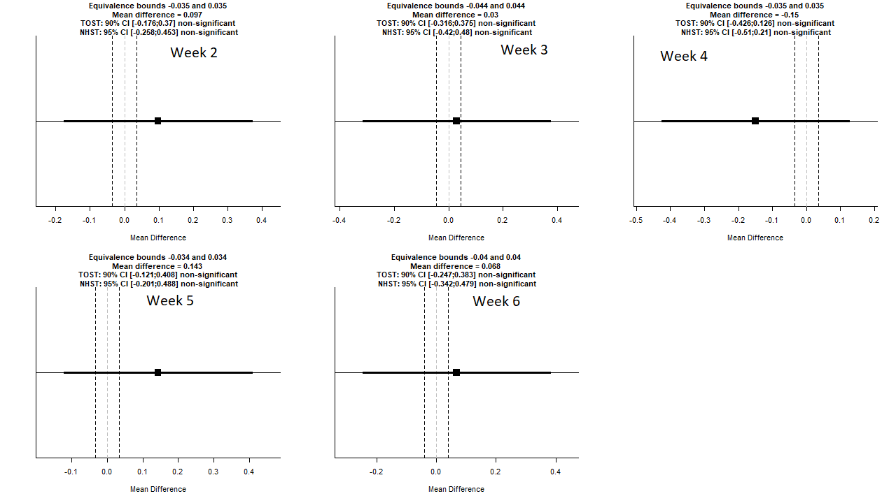

# Biosaftey-Research-on-Transgenic-Clones
Done for Prof. Stuart Strand and the University of Washington's Civil and Environmental Engineering Research Department

### **Packages Needed**

> "TOSTER"
Package Info: https://cran.r-project.org/web/packages/TOSTER/TOSTER.pdf         
`install.packages("TOSTER")`

### **Summary and Results**

Wild type and transgenic clone T3, ten plants each, were cultured on ½ Hoagland's agar in culture boxes, 3 plants per box. The boxes were incubated in a thermostatically controlled incubator under artificial illumination. Starting at 20oC, the temperature was decreased by 5oC increments after 7 to 14 days at each temperature. After each temperature exposure the plants in the boxes were photographed. The total leaves in each box were counted and necrotic leaves (with black spots or completely black or brown) were counted. The ratio of necrotic leaves to total leaves was calculated for each of the three boxes containing wild type or transgenic clone T3. *Using the average ratios from both the WT and T3, an Equivalence Test using TOST was done to test for equivalence* between the two different plant types for each week and it's corresponding temperature, **the null hypothesis being if the two plants are different and the alternate being that they are equivalent. within an acceptable preset limit theta (or bounds).** This theta value is set and defined as the highest tolerated effect size difference. The use of this theta value allows for a analysis of equivalence between the two plant ratio means within a small range as opposed to looking for equality, which implies two distributions that are identical in every way. The TOST ``"TOSTER"`` package was used to calculate whether or not there was equivalence. 'For each week's calculations, equal variances were assumed, an alpha level of .05 was used, along with n = 3, and the corresponding ratio means and standard deviations.'' Much like the equivalence testing done on the Songbird data and in many bioequivalence of pharmaceutical treatments, to tolerate the small effect size, a stringent value of (ln(1.25)) was used as theta to ensure accuracy. Weeks 1, 7, and 8 were omitted also from the test, as in these conditions the plant leaves were either all alive or dead. Calculations can be seen below and in the graph but the concluding evidence found is that, for each week, based on the equivalence test and the null-hypothesis test combined, the observed effect (T3 plants) are statistically not different from zero and statistically not equivalent to zero.

## Week 2
'TOSTfunc(2)''    
TOST results:   
t-value lower bound: 1.03 	p-value lower bound: 0.180   
t-value upper bound: 0.486 	p-value upper bound: 0.674    
degrees of freedom : 4

Equivalence bounds (Cohen's d):   
low eqbound: -0.2231    
high eqbound: 0.2231

Equivalence bounds (raw scores):    
low eqbound: -0.035     
high eqbound: 0.035

TOST confidence interval:   
lower bound 90% CI: -0.176    
upper bound 90% CI:  0.37

NHST confidence interval:   
lower bound 95% CI: -0.258    
upper bound 95% CI:  0.453

Equivalence Test Result:      
The equivalence test was non-significant, t(4) = 0.486, p = 0.674, given equivalence bounds of -0.035 and 0.035 (on a raw scale) and an alpha of 0.05.

Null Hypothesis Test Result:    
The null hypothesis test was non-significant, t(4) = 0.759, p = 0.490, given an alpha of 0.05.

Based on the equivalence test and the null-hypothesis test combined, we can conclude that the observed effect is statistically not different from zero and statistically not equivalent to zero.

## Week 3
`TOSTfunc(3)`   
TOST results:   
t-value lower bound: 0.458 	p-value lower bound: 0.335    
t-value upper bound: -0.0886 	p-value upper bound: 0.467    
degrees of freedom : 4

Equivalence bounds (Cohen's d):   
low eqbound: -0.2231    
high eqbound: 0.2231

Equivalence bounds (raw scores):    
low eqbound: -0.0443    
high eqbound: 0.0443

TOST confidence interval:   
lower bound 90% CI: -0.316    
upper bound 90% CI:  0.375

NHST confidence interval:   
lower bound 95% CI: -0.42   
upper bound 95% CI:  0.48

Equivalence Test Result:    
The equivalence test was non-significant, t(4) = -0.0886, p = 0.467, given equivalence bounds of -0.0443 and 0.0443 (on a raw scale) and an alpha of 0.05.

Null Hypothesis Test Result:    
The null hypothesis test was non-significant, t(4) = 0.185, p = 0.862, given an alpha of 0.05.

Based on the equivalence test and the null-hypothesis test combined, we can conclude that the observed effect is statistically not different from zero and statistically not equivalent to zero.

## Week 4
`TOSTfunc(4)`   
TOST results:
t-value lower bound: -0.885 	p-value lower bound: 0.787
t-value upper bound: -1.43 	p-value upper bound: 0.113
degrees of freedom : 4

Equivalence bounds (Cohen's d):   
low eqbound: -0.2231    
high eqbound: 0.2231

Equivalence bounds (raw scores):    
low eqbound: -0.0354    
high eqbound: 0.0354

TOST confidence interval:   
lower bound 90% CI: -0.426    
upper bound 90% CI:  0.126

NHST confidence interval:   
lower bound 95% CI: -0.51   
upper bound 95% CI:  0.21

Equivalence Test Result:    
The equivalence test was non-significant, t(4) = -0.885, p = 0.787, given equivalence bounds of -0.0354 and 0.0354 (on a raw scale) and an alpha of 0.05.

Null Hypothesis Test Result:    
The null hypothesis test was non-significant, t(4) = -1.158, p = 0.311, given an alpha of 0.05.

Based on the equivalence test and the null-hypothesis test combined, we can conclude that the observed effect is statistically not different from zero and statistically not equivalent to zero.

## Week 5
`TOSTfunc(5)`   
TOST results:   
t-value lower bound: 1.43 	p-value lower bound: 0.113     
t-value upper bound: 0.882 	p-value upper bound: 0.786          
degrees of freedom : 4

Equivalence bounds (Cohen's d):   
low eqbound: -0.2231    
high eqbound: 0.2231

Equivalence bounds (raw scores):    
low eqbound: -0.0339    
high eqbound: 0.0339

TOST confidence interval:   
lower bound 90% CI: -0.121    
upper bound 90% CI:  0.408

NHST confidence interval:   
lower bound 95% CI: -0.201    
upper bound 95% CI:  0.488

Equivalence Test Result:      
The equivalence test was non-significant, t(4) = 0.882, p = 0.786, given equivalence bounds of -0.0339 and 0.0339 (on a raw scale) and an alpha of 0.05.

Null Hypothesis Test Result:    
The null hypothesis test was non-significant, t(4) = 1.155, p = 0.312, given an alpha of 0.05.

Based on the equivalence test and the null-hypothesis test combined, we can conclude that the observed effect is statistically not different from zero and statistically not equivalent to zero.

## Week 6
`TOSTfunc(6)`    
TOST results:   
t-value lower bound: 0.735 	p-value lower bound: 0.251    
t-value upper bound: 0.189 	p-value upper bound: 0.570    
degrees of freedom : 4

Equivalence bounds (Cohen's d):   
low eqbound: -0.2231    
high eqbound: 0.2231

Equivalence bounds (raw scores):    
low eqbound: -0.0404    
high eqbound: 0.0404

TOST confidence interval:   
lower bound 90% CI: -0.247    
upper bound 90% CI:  0.383

NHST confidence interval:   
lower bound 95% CI: -0.342    
upper bound 95% CI:  0.479

Equivalence Test Result:    
The equivalence test was non-significant, t(4) = 0.189, p = 0.570, given equivalence bounds of -0.0404 and 0.0404 (on a raw scale) and an alpha of 0.05.

Null Hypothesis Test Result:        
The null hypothesis test was non-significant, t(4) = 0.462, p = 0.668, given an alpha of 0.05.

Based on the equivalence test and the null-hypothesis test combined, we can conclude that the observed effect is statistically not different from zero and statistically not equivalent to zero.
