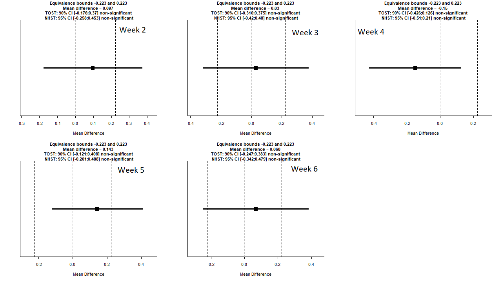
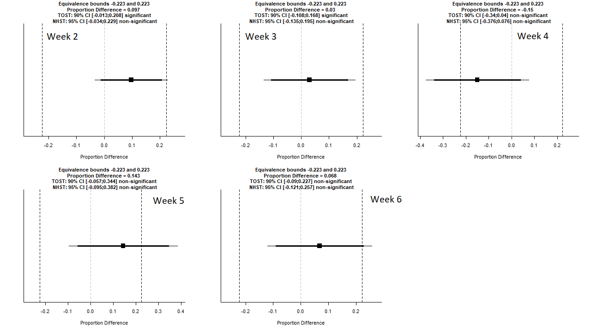

# Biosaftey-Research-on-Transgenic-Clones
Done for Prof. Stuart Strand and the University of Washington's Civil and Environmental Engineering Research Department

### **Packages Needed**

> "TOSTER"
Package Info: https://cran.r-project.org/web/packages/TOSTER/TOSTER.pdf         
`install.packages("TOSTER")`

### **Summary and Results**

Wild type and transgenic clone T3, ten plants each, were cultured on ½ Hoagland's agar in culture boxes, 3 plants per box. The boxes were incubated in a thermostatically controlled incubator under artificial illumination. Starting at 20oC, the temperature was decreased by 5oC increments after 7 to 14 days at each temperature. After each temperature exposure the plants in the boxes were photographed. The total leaves in each box were counted and necrotic leaves (with black spots or completely black or brown) were counted. The ratio of necrotic leaves to total leaves was calculated for each of the three boxes containing wild type or transgenic clone T3.

*Using the average ratios from both the WT and T3, an Equivalence Test using TOST was done to test for equivalence* between the two different plant types for each week and it's corresponding temperature, **the null hypothesis being if the two plants are different and the alternate being that they are equivalent within an acceptable preset limit theta (or bounds).** This theta value is set and defined as the highest tolerated effect size difference. The use of this theta value allows for a analysis of equivalence between the two plant ratio means within a small range as opposed to looking for equality, which implies two distributions that are identical in every way (Chow, S. C., 1999, Limentani et al., 2005, Longford, N. T., 2005, Walker and Nowacki, 2011). The TOST ``"TOSTER"`` package, and it's function: `TOSTtwo.raw()`, was used to calculate whether or not there was equivalence. For each week's calculations, equal variances were assumed, an **alpha level of .05** was used, along with **n = 3**, and the **corresponding ratio means and standard deviations** resulting in answers in a normal distribution. After statistical consulting, a proportional(binomial) calculation and analysis were also done with an **alpha level of .05**, **n = number of total leaves per week**, and **corresponding ratios.** and were inputed into the `TOSTtwo.prop` function. Much like the equivalence testing done on the Songbird data and in many bioequivalence tests of pharmaceutical treatments, to tolerate the small effect size, a stringent value of (ln(1.25)) was used as theta to ensure accuracy (Jaki, T., 2010, Limentani et al., 2005, Longford, N. T., 2005, Rose, E. M. et al., 2018, Schall, R., 1996). Weeks 1, 7, and 8 were omitted also from the test, as in these conditions the plant leaves were either all alive or dead. Calculations can be seen below and in the graphs. Since Equivalence testing is a modified hypothesis test that places the burden of proof on equivalence rather than difference (Limentani et al., 2005, Walker and Nowacki, 2011), the concluding evidence found is that, for each week, based on the equivalence test and the null-hypothesis test combined, the observed effect (T3 plants) are statistically not different from zero and statistically not equivalent to zero and therefore equivalent.

### **Normal Distribution**

## **Binomial Distribution (Proportional)**

P Values Taken from Function,
## Week 2
**Normal:**   
p-value lower bound: 0.033
p-value upper bound: 0.191   
**Binomial:**   
p-value lower bound: 0.0000009    
p-value upper bound: 0.030

## Week 3
**Normal:**   
p-value lower bound: 0.097
p-value upper bound: 0.150   
**Binomial:**    
p-value lower bound: 0.001    
p-value upper bound: 0.011

## Week 4
**Normal:**   
p-value lower bound: 0.301
p-value upper bound: 0.023
**Binomial:**   
p-value lower bound: 0.263    
p-value upper bound: 0.0006

## Week 5
**Normal:**   
p-value lower bound: 0.021
p-value upper bound: 0.277   
**Binomial:**     
p-value lower bound: 0.001    
p-value upper bound: 0.256

## Week 6
**Normal:**   
p-value lower bound: 0.060    
p-value upper bound: 0.177
**Binomial:**    
p-value lower bound: 0.001    
p-value upper bound: 0.054
